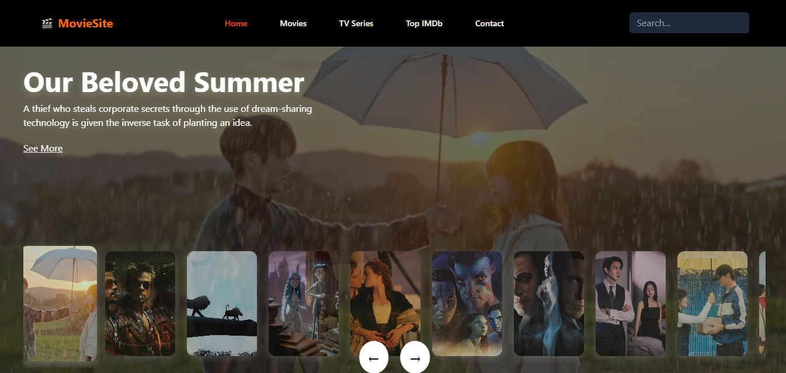

# Movie Site

Welcome to the **Movie Site** project! This is a movie discovery website where users can explore movies, TV series, and top-rated films. The website is built with **React** and integrates with **Firebase** for real-time data fetching.

## Features
- **Responsive Design**: The website is fully responsive and works well on both desktop and mobile devices.
- **Navigation**: The navigation bar contains links to various sections such as Home, Movies, TV Series, Top Rated, Genres, New Releases, and My List.
- **Search Functionality**: Users can search for movies or TV shows using a search bar located in the navbar.
- **Real-time Data**: Movie and TV series information (like genres, titles, and posters) are fetched from **Firebase Realtime Database**.
- **Movie and TV Series Filters**: Filter movies by genre and explore top-rated films.
- **Pagination**: The movie list is paginated to display a limited number of movies per page, improving the user experience.

## Technologies Used
- **React**: A JavaScript library for building user interfaces.
- **Firebase**: A backend-as-a-service to handle real-time data.
- **Tailwind CSS**: A utility-first CSS framework to style the components.
- **React Router**: A library to manage navigation between different routes of the site.
- **React Icons**: A library to use vector icons in React apps.

## 📸 Preview
